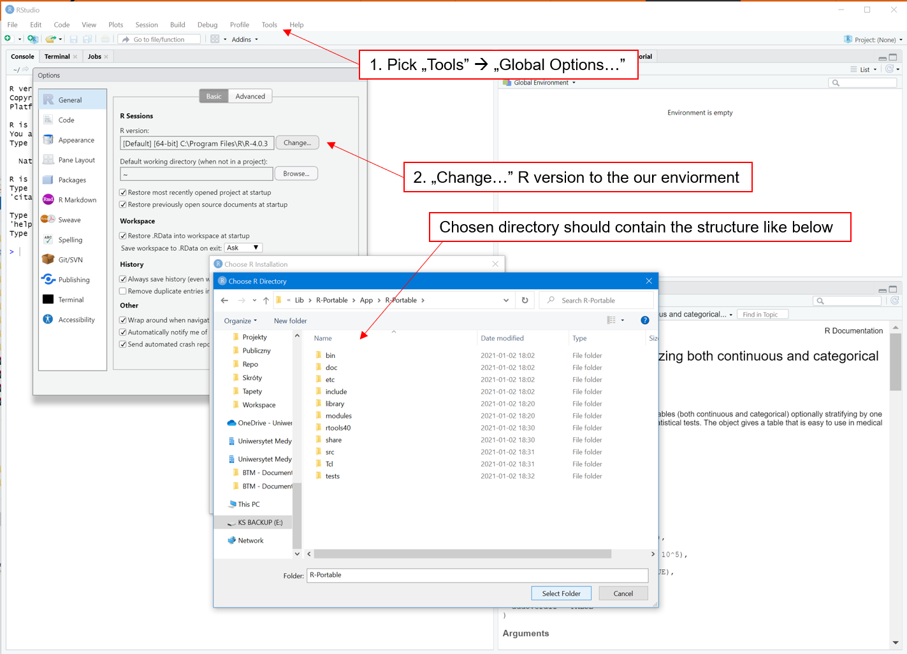
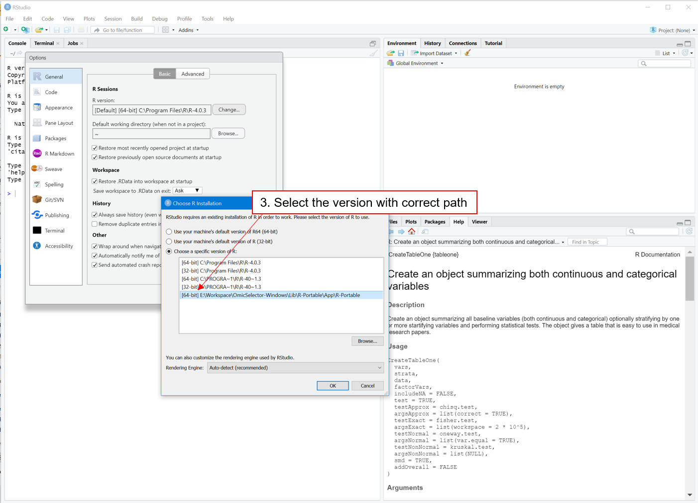
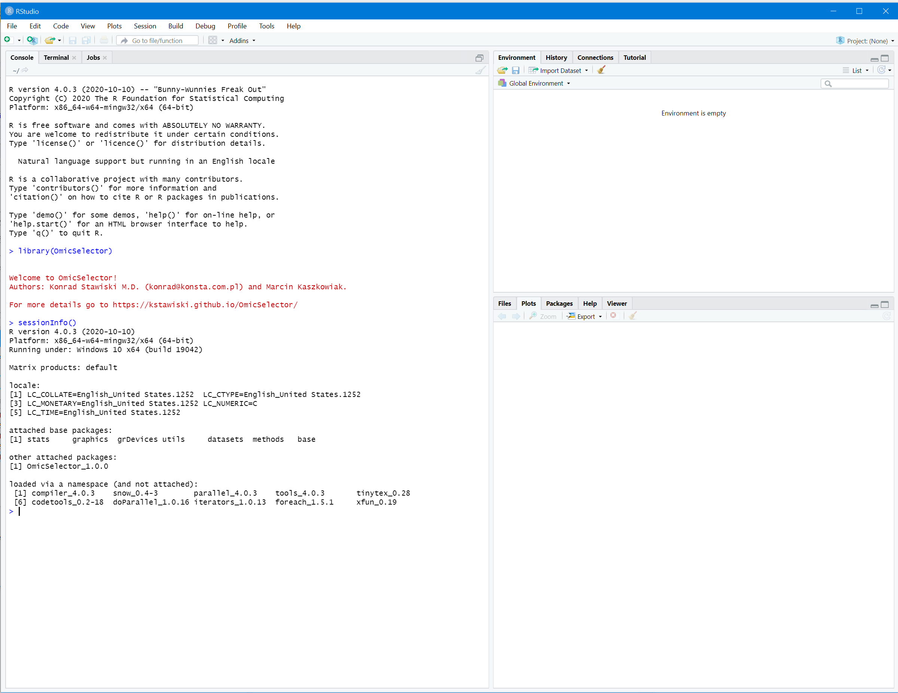

# OmicSelector

 

Environment, docker-based application and R package for biomarker signiture selection (feature selection) from high-throughput high-throughput omics experiments and other multidimensional datasets. Initially developed for miRNA-seq, RNA-seq and qPCR.

Go to https://kstawiski.github.io/OmicSelector/ for more details.

## Quick start

### Docker 


1. GPU-based, using Nvidia CUDA: [kstawiski/omicselector-gpu](https://hub.docker.com/r/kstawiski/omicselector-gpu)

```
docker run --name OmicSelector --restart always -d -p 28888:80 --gpus all -v $(pwd)/:/OmicSelector/host/ kstawiski/omicselector-gpu
```

2. CPU-based: [kstawiski/omicselector](https://hub.docker.com/r/kstawiski/omicselector)

```
docker run --name OmicSelector --restart always -d -p 28888:80 -v $(pwd)/:/OmicSelector/host/ kstawiski/omicselector
```

As docker image updates itself, it may take few minutes for the app to be operational. You can check logs using `docker logs OmicSelector`. The GUI is accessable via `http://your-host-ip:28888/`. If you use command above, your working directory will be binded as `/OmicSelector/host/`.

### R package:

#### Own enviorment:

```
library("devtools") # if not installed, install via install.packages('devtools')
source_url("https://raw.githubusercontent.com/kstawiski/OmicSelector/master/vignettes/setup.R")
install_github("kstawiski/OmicSelector", force = T)
library(keras)
install_keras()
library(OmicSelector)
OmicSelector_setup()
```

#### Linux/macOS using conda

1. Installing the package in own Anaconda enviorment:

Use e.g. `conda create -n OmicSelector` and `conda activate OmicSelector` to set up your enviorment.  Please note the this will work only when running on **Linux (Ubuntu)** OS or macOS.

```
conda install --channel "conda-forge" --channel "anaconda" --channel "r" tensorflow keras jupyter jupytext numpy pandas r r-devtools r-rgl r-rjava r-mnormt r-purrrogress r-xml gxx_linux-64 libxml2 pandoc r-rjava r-magick opencv pkgconfig gfortran_linux-64
echo "options(repos=structure(c(CRAN='http://cran.r-project.org')))" >> ~/.Rprofile
Rscript -e 'update.packages(ask = F); install.packages(c("devtools","remotes")); remotes::install_cran("pkgdown");'
Rscript -e 'devtools::source_url("https://raw.githubusercontent.com/kstawiski/OmicSelector/master/vignettes/setup.R")'
```

If you have compatible GPU you can consider changing `tensorflow` to `tensorflow-gpu` in `mamba install` command.

#### Windows OS

You can download our Windows-based R enviroment from here: https://studumedlodz-my.sharepoint.com/:u:/g/personal/btm_office365_umed_pl/EQUihquz915JoVhsQQShcnoBZaukMkwd3MnC1LER0iORNw?e=W6KEyu 

After unpacking, if you wish to use our enviorment please consider setting the our R version in your [R Studio](https://rstudio.com/products/rstudio/download/) installation:








## Footnote

Citation:

`In press.`

Authors:

- [Konrad Stawiski, M.D. (konrad@konsta.com.pl)](https://konsta.com.pl)
- Marcin Kaszkowiak.

For any troubleshooting use [https://github.com/kstawiski/OmicSelector/issues](https://github.com/kstawiski/OmicSelector/issues).

Department of Biostatistics and Translational Medicine, Medical Univeristy of Lodz, Poland (https://biostat.umed.pl) 
